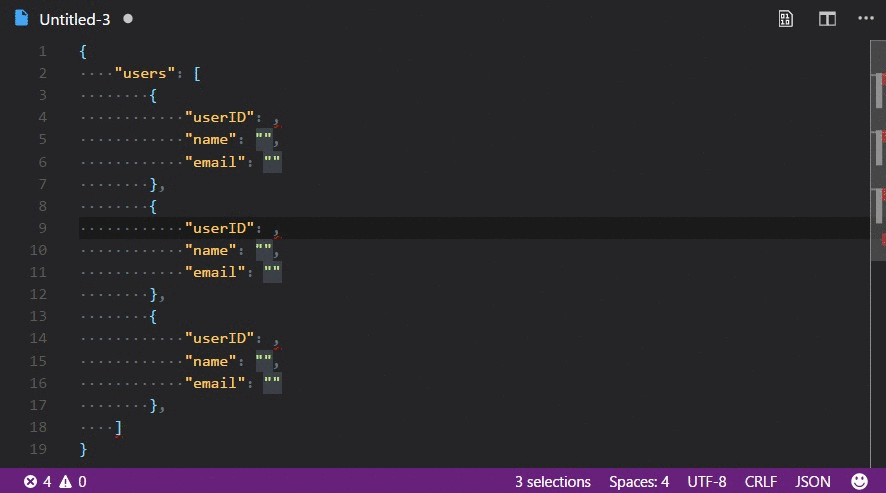

# Random Everything

A VS Code extension that generates random ints, floats, strings, words, etc.

This is intended to be a feature to feature VS Code port of [Random Everything for Sublime Text.](https://github.com/kimpettersen/random-sublime-text-plugin)

## Demo

## Useage

### Command Palette

Bring up the command palette:

* <kbd>⇧⌘P</kbd> (*OSX*)
* <kbd>Ctrl + Shift + P</kbd> (*Windows/Linux*)

Type "random":

* `Random: Int` - Requires a range from a-b separated with a: *-*. Default: 1-100
* `Random: Float` - Requires a range from a-b separated with a: *-*. Default: 1-100
* `Random: Letters` - Generatates a random string of lower and uppercase letters with a length between 5 and 20
* `Random: Letters and numbers` - Generatates a random string of lower and uppercase letters and numbers with a length between 5 and 20
* `Random: Country` - Picks a random country
* `Random: Word` - Picks a random word
* `Random: Text` - Picks 24 random words
* `Random: Date` - Picks a random ISO-8601 Date
* `Random: First name` - Picks a random first name
* `Random: Last name` - Picks a random last name
* `Random: Full name` - Picks a random full names
* `Random: E-mail` - Picks a random E-mail address
* `Random: Url` - Generates a URL using random words
* `Random: Hex Color` - Generates a random hex color formatted \"#abc123\"
* `Random: IPv4 Address` - Generates a random ipv4 ip address
* `Random: IPV6 Address` - Generates a random ivp6 ip address
* `Random: GUID` - Generates a random GUID

## Extension Settings

* `randomeverything.enable`: Enable/disable this extension.

## Updates

See [changelog](CHANGELOG.md).

## @TODO
- [ ] Overridable settings

## References

* Features from Sublime extension: [kimpettersen/random-sublime-text-plugin](https://github.com/kimpettersen/random-sublime-text-plugin)
* Implementation of: [Chance.JS](https://github.com/chancejs/chancejs)